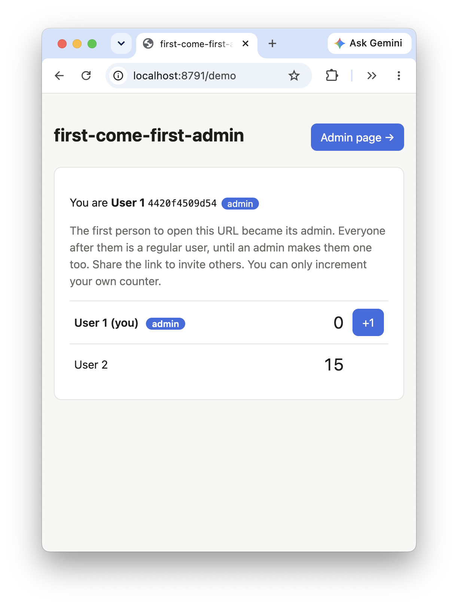
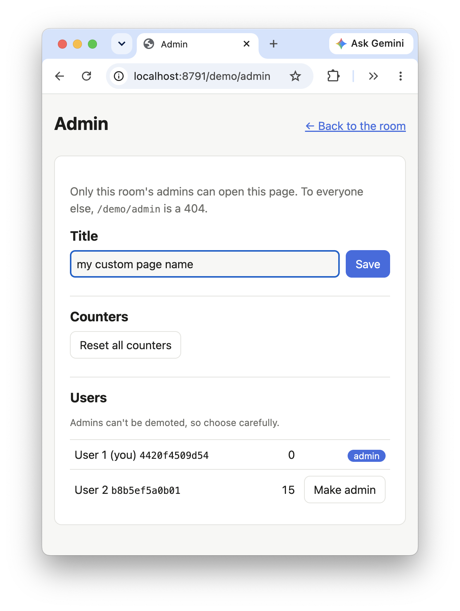
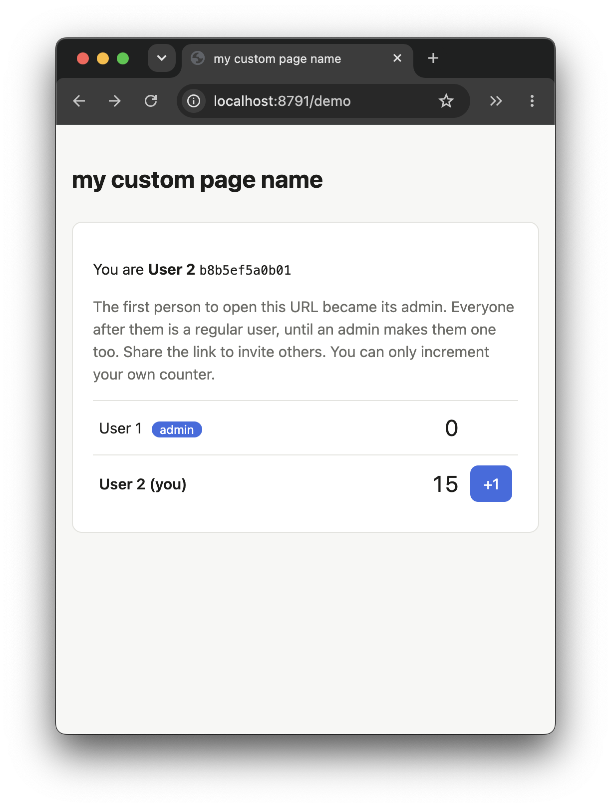

# first-come-first-admin: the first visitor to a URL is its admin

A minimal example of **roles without a login**. The first person to open a URL like `/standup` becomes that room's admin, and everyone after them is a regular user. Admins get a link to `/standup/admin`, which to everyone else is a 404. From there they can retitle the room, reset everyone's counter, and make any other user in the room an admin.

It's modelled on the counter demo in [`dembrane-auth-cookie`](../dembrane-auth-cookie), minus dembrane: nobody logs in. The Worker gives each browser an anonymous cookie, and each room is a Durable Object that remembers who got there first.

| admin claims room first | accesses admin page | user sees changes |
|---|---|---|
|  |  |  |

## Run it

```sh
pnpm install
pnpm dev        # http://localhost:8791
```

Open <http://localhost:8791>. It sends you to a new room with a random id, so you're its admin. Open the same URL in a private window, or another browser, to join as a regular user. Each example has its own port, so you can run them side by side.

## How it works

- **Who you are.** On your first request the Worker sets `ffa_token`, a random secret, in an `HttpOnly; SameSite=Lax` cookie. Your **public id** is part of the SHA-256 of that token. Admins see it and use it to make you an admin, but it can't be turned back into your cookie, so knowing it doesn't let anyone act as you. The same cookie works in every room.
- **Who's first.** Each URL id gets its own `Room` Durable Object (`ROOM.getByName(id)`). It holds the title, and a SQLite table of users with their counters and admin flags. Opening the room calls `join()`, which adds you as an admin if the room has no users yet. A Durable Object runs one call at a time, so two people opening a new room at the same moment can't both be first.
- **Who may do what.** As in the counter demo, the Durable Object does no auth itself. The Worker looks you up in the room and checks `isAdmin` before every admin call, and before serving the admin page at all. The pages are bundled into the Worker as text (see `rules` in `wrangler.jsonc`) rather than served as static assets, so there's no URL where a non-admin could fetch the admin page's HTML.
- **The origin check.** The browser attaches the cookie to requests started by other pages on the same site too (locally, any other `localhost` port). So the Worker turns down a request that changes something unless it comes from its own origin (`Sec-Fetch-Site: same-origin`, or a matching `Origin`), like `requireDirectusSession` in `dembrane-auth-cookie`.

| Route | Who | Does |
|---|---|---|
| `GET /` | anyone | Redirects to a new room with a random id |
| `GET /:id` | anyone | The room page |
| `GET /:id/admin` | the room's admins | The admin page. Everyone else gets a 404 |
| `GET /api/rooms/:id` | anyone | Joins you (the first one in is admin), and returns `{ me, title, users }` |
| `POST /api/rooms/:id/increment` | anyone in the room | Increments your own counter, and only yours |
| `PUT /api/rooms/:id/title` | the room's admins | `{ "title": "…" }`, 1 to 100 characters |
| `POST /api/rooms/:id/reset` | the room's admins | Sets every counter to 0 |
| `POST /api/rooms/:id/users/:uid/admin` | the room's admins | Makes someone already in the room an admin. There's no demoting |

## Try it with curl

```sh
U=localhost:8791; O="Origin: http://$U"
curl -s -c a.txt -b a.txt $U/api/rooms/test | jq .me                 # Alice: first in, so admin
B=$(curl -s -c b.txt -b b.txt $U/api/rooms/test | jq -r .me.id)       # Bob: a regular user
curl -s -o /dev/null -w '%{http_code}\n' -b b.txt $U/test/admin       # 404
curl -s -b b.txt -H "$O" -X POST $U/api/rooms/test/reset              # 403: not an admin
curl -s -b b.txt -X POST $U/api/rooms/test/increment                  # 403: not from the room's origin
curl -s -b b.txt -H "$O" -X POST $U/api/rooms/test/increment          # 200
curl -s -b a.txt -H "$O" -X PUT -H 'content-type: application/json' -d '{"title":"Standup"}' $U/api/rooms/test/title
curl -s -b a.txt -H "$O" -X POST $U/api/rooms/test/reset
curl -s -b a.txt -H "$O" -X POST $U/api/rooms/test/users/$B/admin     # Bob is an admin now
curl -s -o /dev/null -w '%{http_code}\n' -b b.txt $U/test/admin       # 200
```

## Files

```
src/index.ts         routes, the identity cookie, the origin check, and the admin checks
src/room.ts          the Room Durable Object: join(), increment(), setTitle(), resetCounts(), makeAdmin()
src/pages/           room.html, admin.html and style.css, bundled into the Worker as text
src/text.d.ts        types for those text imports
wrangler.jsonc       the Room binding, the text-module rule, the dev port
```

## Before relying on it

- **Whoever opens the link first wins.** That includes link previewers and scanners that fetch URLs they're sent. The page joins you with a `GET /api/rooms/:id` from its own script, so a crawler that doesn't run JavaScript won't claim a room, but one that does will. A real app would claim a room with a deliberate `POST`, or create it and hand the creator a link.
- **Your identity is your cookie.** Clear it, or switch browsers, and you're a new user. An admin who loses their cookie loses the room, unless another admin is left.
- **There's no demoting or removing anyone,** and nothing cleans up rooms nobody visits.
- **Deploy** with `pnpm deploy`. There are no secrets to set.
