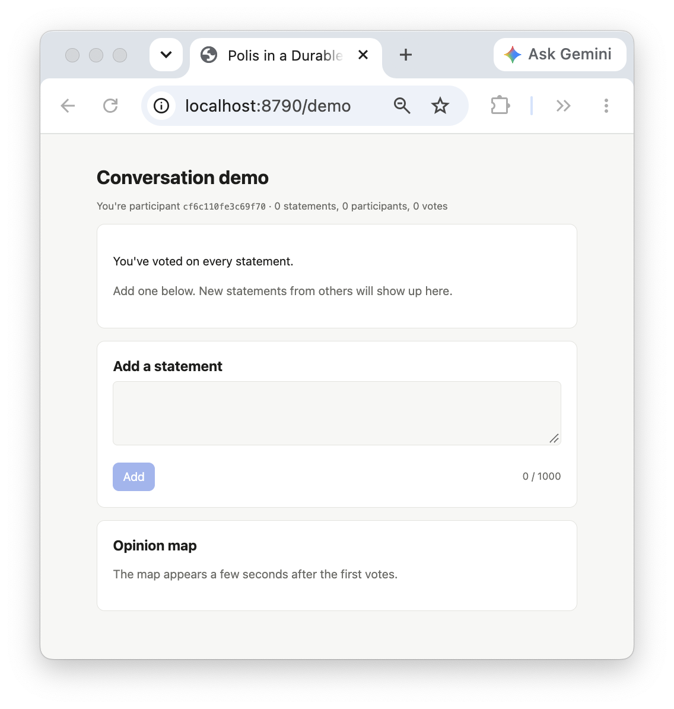
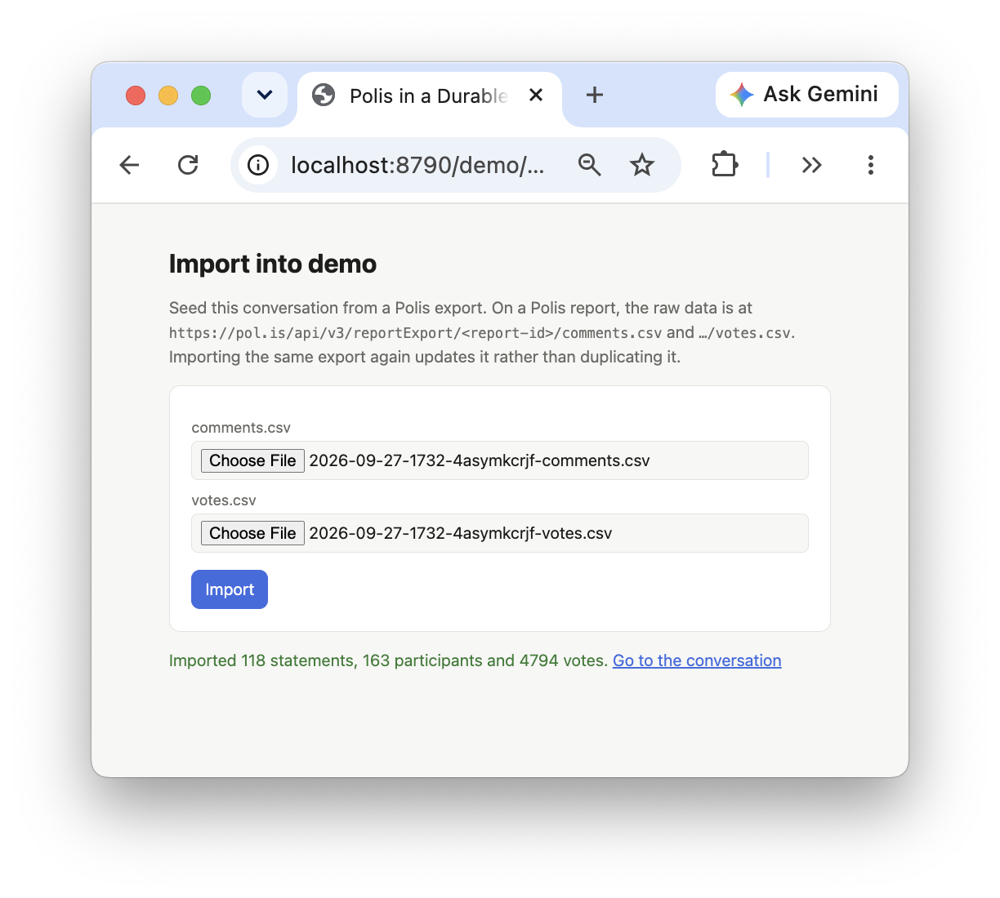
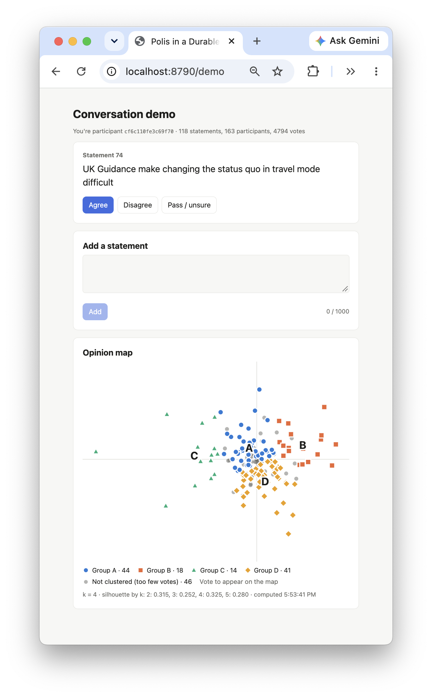

# polis-durable-object: a Polis-style conversation in a Durable Object

A minimal [Polis](https://pol.is)-style conversation, running in one Cloudflare Durable Object per conversation. Participants add statements and vote agree, disagree or pass. An alarm recomputes the opinion groups a few seconds after the votes come in, and a live map of every participant updates over a WebSocket. An admin page seeds a conversation from a Polis CSV export, so you can try it on real data.

There's no login, no moderation and no project or group-chat scope yet. Each is a later layer: see [`PLAN.md`](PLAN.md#later).

| New conversation | Import page | Populated conversation |
|---|---|---|
|  |  |  |

## Run it

```sh
pnpm install
pnpm dev        # http://localhost:8790
pnpm test       # the math and CSV parser tests
```

Open <http://localhost:8790> and start a conversation, or go straight to any path: `/anything` is a conversation, created the first time it's used. Share the link, or open it in a private window, to vote as a second participant.

Each example has its own port (the auth examples use 8787 to 8789), so you can run them side by side.

## Try it on real data

Download a Polis report's raw data. For a report at `https://pol.is/report/<report-id>`, the files are at:

```
https://pol.is/api/v3/reportExport/<report-id>/comments.csv
https://pol.is/api/v3/reportExport/<report-id>/votes.csv
```

Then upload both at `/<conversation>/admin`, or with curl:

```sh
curl -H 'Origin: http://localhost:8790' -F comments=@comments.csv -F votes=@votes.csv \
  localhost:8790/api/transport/import
# {"statements":118,"participants":163,"votes":4794}
```

Open `/transport` to see the map, and vote alongside the imported participants. Importing the same export again updates it rather than duplicating it.

## How it works

- **The Worker** (Hono) routes `/api/:convoId/*` to that conversation's Durable Object with `getByName(convoId)`. The DO trusts the participant ID the Worker passes it.
- **Who you are:** the Worker gives each browser a random secret in a `polis_participant` cookie (`HttpOnly`, a year long). Your public participant ID is a hash of it, because the IDs are sent to everyone for the map and mustn't work as credentials. A cookie also works on the WebSocket upgrade, where a page can't set headers. Requests that change something must come from the page's own origin.
- **The Conversation DO** keeps `participants`, `statements` and `votes` in its SQLite storage. Votes are 1 (agree), −1 (disagree) and 0 (pass), as in Polis's `votes.csv`, and voting again replaces your vote. Unlike Polis, adding a statement doesn't vote for you, so you can vote on your own statements.
- **Live updates:** the page opens a WebSocket (with [partysocket](https://github.com/partykit/partykit/tree/main/packages/partysocket), which reconnects by itself), and the DO accepts it with the hibernation API. A new socket gets a snapshot; after every write, every socket gets the new counts. Pages never send over the socket: all writes go through HTTP.
- **The math:** each write schedules an alarm 3 seconds out, unless one is pending, so a burst of votes runs the math once and an idle conversation never wakes. The alarm runs `computeMath`, saves the result and sends it to every socket.

## The math, and how it differs from Polis

`src/worker/math.ts` is a simplified port of Polis's Clojure math (`math/src/polismath/math/`):

1. **PCA** on the participants × statements vote matrix, with a missing vote treated as the statement's average vote, gives two components.
2. **Each participant is projected** using only the statements they voted on, then scaled by √(statements / their votes), which pushes sparse voters out from the center.
3. **Who gets clustered:** everyone with at least 7 votes (or as many as there are statements), topped up with the most active voters to 15.
4. **k-means** for k = 2 to 5, keeping the k with the best silhouette score.

Polis also clusters its participants into 100 base clusters first, and smooths k so it only changes after it's been better for a while. We leave both out, so **the number of groups can jump** from one recompute to the next, and it won't always match a Polis report. On the #TransportNewNormal export, Polis's report shows 3 groups; this shows 4, with silhouettes of 0.315 (k = 2), 0.252 (3), 0.325 (4) and 0.280 (5), and a few new votes tip it to 3. The map's footer shows `k` and the silhouettes, to make this easy to watch.

## The CSV import

`src/worker/polis-csv.ts` reads Polis's `comments.csv` and `votes.csv`, matching columns by name (as in Polis's `server/src/routes/report.ts`), with a small RFC 4180 parser for quoted commas, quotes and newlines.

- Comments a moderator rejected (`moderated = -1`) are skipped. That's the only moderation we respect.
- If a voter has several rows for one comment, the latest `timestamp` wins.
- Imported participants get IDs like `polis:<voter-id>`, so they can't collide with people voting here.
- The DO writes everything in one transaction, then runs the math straight away.

## API

| Route | What it does |
|---|---|
| `GET /api/:convoId/me` | `{ participantId }`, and sets the cookie |
| `GET /api/:convoId/next` | A random statement you haven't voted on, or `null` |
| `POST /api/:convoId/statements` | `{ text }` (1–1,000 characters) → the new statement |
| `POST /api/:convoId/votes` | `{ statementId, vote: -1 \| 0 \| 1 }` → 204 |
| `GET /api/:convoId/ws` | The WebSocket: `snapshot`, `counts` and `math` messages |
| `POST /api/:convoId/import` | A multipart form with `comments` and `votes` files → how many rows were imported |

The message types are in `src/shared/types.ts`.

## Files

```
src/worker/index.ts            routes, the participant cookie, the origin checks
src/worker/conversation.ts     the Conversation Durable Object: schema, RPC methods, WebSockets, alarm
src/worker/math.ts             PCA and k-means, pure functions
src/worker/polis-csv.ts        the CSV parser and Polis export reader, pure functions
src/shared/types.ts            API and WebSocket types, used by the Worker and the page
src/react-app/                 the pages: Home, Participant (vote card, statement form, map), Admin
test/                          Vitest tests for math.ts and polis-csv.ts
docs/                          the README's screenshots
wrangler.jsonc                 the Durable Object binding and static assets
PLAN.md                        the plan this was built from, and what comes later
```

The layout follows Cloudflare's [`vite-react-template`](https://github.com/cloudflare/templates/tree/main/vite-react-template): `pnpm dev` runs the Worker and the Durable Object in workerd through `@cloudflare/vite-plugin`.

## Known quirks

- **Under `pnpm dev`, a rejected WebSocket upgrade hangs** instead of returning 403: Vite's dev proxy seems to drop any response to an upgrade that isn't 101. The Worker itself answers correctly, as `wrangler dev` on the build (`dist/polis_durable_object/wrangler.json`) or a deploy shows.
- **The admin page has no auth**, on purpose, for the demo. Anyone who can reach it can import into any conversation.

## Going further

See [`PLAN.md`](PLAN.md#later): real dembrane logins, projects and group chats holding conversations, moderation, Polis's base clusters and k smoother, and rendering the map with [react-polis-opinion-graph](https://github.com/patcon/react-polis-opinion-graph).
