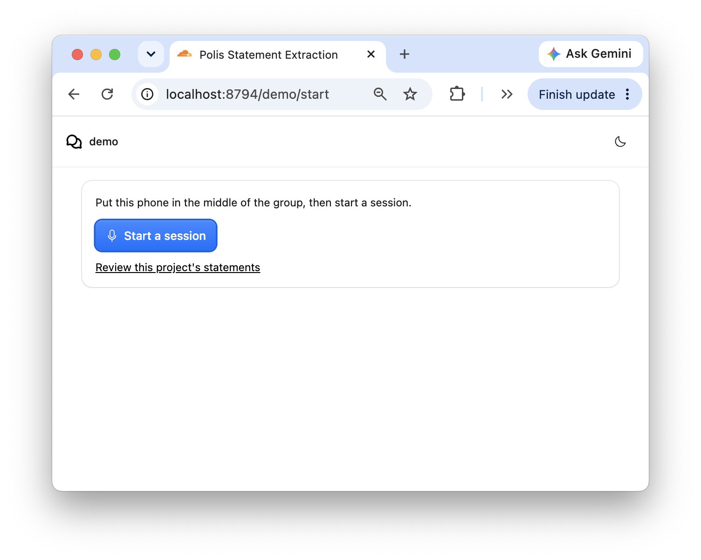
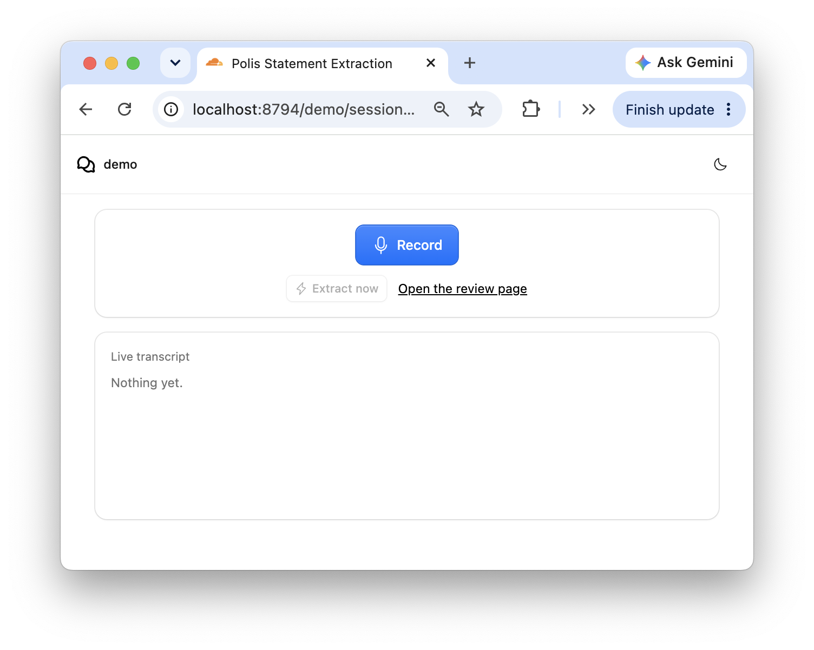
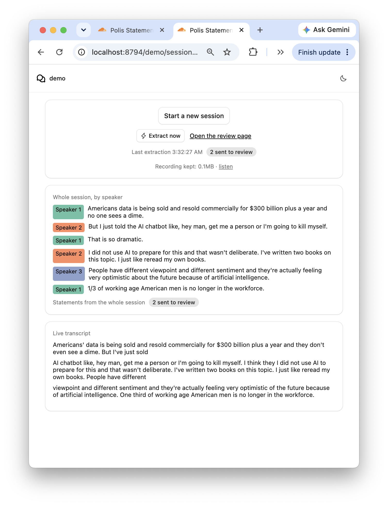
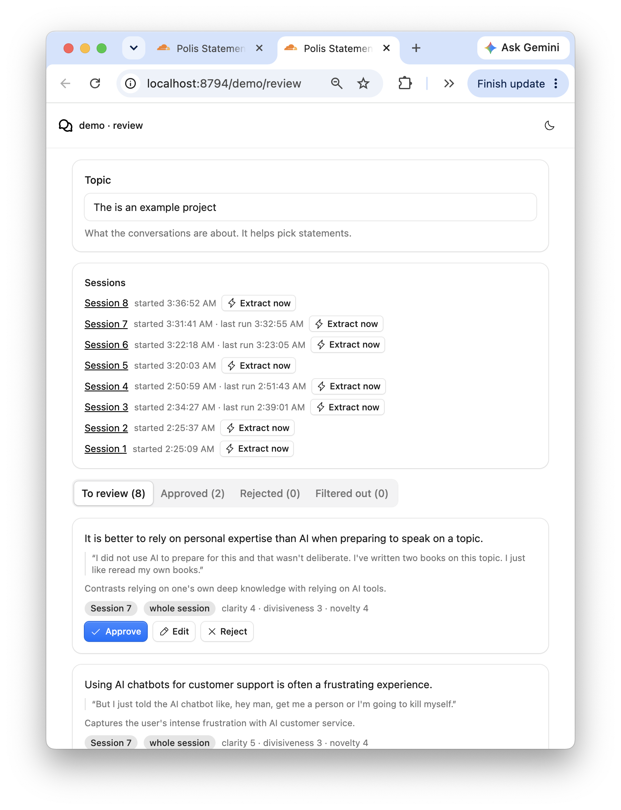

# polis-statement-extraction: Polis statements from a live group conversation

A group sits around one phone, which records their conversation. While they talk, Gemini transcribes it live. Every 5 minutes, or when someone presses **Extract now**, a Gemini model pulls out Polis-style statements of belief: short, single-idea claims people could agree or disagree with. A host on another device reviews every session's statements, and approves, edits or rejects each one. Once the recording stops, the whole session is transcribed again with speakers told apart, and one last extraction runs over it.

There's no voting yet. A session is a group, not one person, so who reacts to what is a later question. There's no login either.

| Start a session | Record your group conversation |
|---|---|
|  |  |

| Transcribed session | Host reviews extracted statements |
|---|---|
|  |  |

## Run it

```bash
pnpm install
cp .dev.vars.example .dev.vars   # set GOOGLE_CLOUD_PROJECT
pnpm google-token                # puts `gcloud auth print-access-token` in .dev.vars
pnpm dev
```

Then open <http://localhost:8794>, pick a project name such as `demo`, and start a session. To record from a phone, use `pnpm dev:share` instead: it also prints a public link.

Everything runs on Gemini on Vertex AI, so you need a Google Cloud project with Vertex AI enabled and `gcloud` logged in to it. The token lasts about an hour, so run `pnpm google-token` again when it expires. A failed extraction says why on both pages, such as an expired token.

| Command | What it does |
|---|---|
| `pnpm test` | The filter, the response parser and the WAV helpers, then the Gemini provider's tests |
| `pnpm typecheck` | The Worker (`tsconfig.json`) and the page (`tsconfig.client.json`) |
| `pnpm lint`, `pnpm format` | Biome |

## Pages

| URL | Who | What |
|---|---|---|
| `/:projectId/start` | The recording phone | **Start a session** makes a new session with a random ID |
| `/:projectId/sessions/:sessionId` | The recording phone | Record and stop, the live transcript, and the last extraction run. Once stopped, the whole session by speaker |
| `/:projectId/sessions/:sessionId?debug=true` | Whoever's testing | Replay an audio file instead of recording. See [Replaying an audio file](#replaying-an-audio-file) |
| `/:projectId/review` | The host | The project's sessions, each with **Extract now**, and every proposed statement: to review, approved, rejected and filtered out |

A project is any name, made the first time it's used. `/:projectId/` on its own opens the start page.

## How a session works

1. **Recording.** The page streams the microphone to the session's agent with `useVoiceInput`. The agent sends it on to `gemini-3.5-transcribe-live-preview`, and saves each finalized utterance as a live segment.
2. **Extraction, every 5 minutes.** While recording, a timer queues an extraction run, unless fewer than 150 words came in since the last one. **Extract now** queues one straight away, and so does stopping. Each run sends the new segments, with a few before them for context, to `gemini-3.5-flash`. The prompt includes the project's topic and its existing statements, and the model answers in JSON.
3. **Filtering.** The project drops what's plainly unusable: empty, over 180 characters, a question, or the same words as an existing statement, including rejected ones. Dropped statements are kept, with their reason, on the review page's **Filtered out** tab, as data for tuning the prompt.
4. **A compressed copy.** Beside the live stream, the page records the microphone with `MediaRecorder` (Opus at 24kbps, about 11MB an hour) and uploads it in 10-second pieces to R2.
5. **The final pass.** Once you stop, the session joins the pieces and sends them to `gemini-3.5-transcribe-preview` in one request, telling speakers apart. The same speaker keeps the same number across the whole session. One last extraction then runs over that transcript, looking for views that only show across the whole conversation. Its statements are marked "whole session".

Stopping ends the session for good, since the recording has to be one file. If the page goes away mid-recording, such as on a reload, the session offers **Finish**, which diarizes what was recorded.

### Limits

- **Diarized recordings up to 30 minutes.** The transcription model only tells speakers apart in [up to 30 minutes of audio](https://ai.google.dev/gemini-api/docs/transcribe). Past that, the recording page warns, and a replayed file skips the final pass. A longer recording keeps its live statements. Recordings are also kept under 14MB, after the Gemini Developer API's old 20MB cap on an inline request; Vertex doesn't state its own.
- **Sessions up to about an hour**, because of the token. Gemini Live itself resumes past Vertex's session limits; see [`packages/voice-gemini`](packages/voice-gemini/README.md).
- **Formats.** The page records Opus in WebM, or in Ogg, where the browser can, else AAC in MP4. Gemini takes all three. Only WebM from Chrome has been tried end to end.

### The prompt

[`src/server/extract/prompt.ts`](src/server/extract/prompt.ts) holds it, with `PROMPT_VERSION`, which is saved with each statement. It asks for at most 8 statements per run. Each has to hold one idea, make sense on its own, be something people could agree or disagree with, not be a question or a plain fact, and name no one. Each comes with the quote it rests on, a one-line rationale, and the model's own 1–5 scores for clarity, divisiveness and novelty. Returning nothing is a fine answer for small talk.

## Replaying an audio file

Add `?debug=true` to a new session's link, or follow the faint **debug** link at the bottom of its page, to replay a recording instead of using the microphone. The page decodes the file and resamples it to 16kHz mono. It sends the audio to the session in WAV windows, 5 minutes long by default, as often as extraction runs while recording. The panel can shorten them to as little as 30 seconds, to see statements sooner, at the cost of more requests and less context per run. It can also give each run more earlier segments as context than the 3 used while recording. Each window is transcribed by `gemini-3.5-transcribe-preview` in place of the live text, then extracted from as usual. If the file is small enough for one request, it then becomes the session's recording, and the final pass runs.

An hour-long file takes a few minutes and makes about 26 Gemini requests: 12 windows each transcribed and extracted from, then the final pass's two.

To make a file small enough for the final pass:

```bash
ffmpeg -i meeting.m4a -ac 1 -c:a libopus -b:a 24k meeting.webm
```

## How it works

Two kinds of [Agent](https://developers.cloudflare.com/agents/), each a Durable Object with its own SQLite:

- **`ProjectAgent`**, one per project. It lists its sessions and keeps every proposed statement. The review page connects to it.
- **`SessionAgent`**, one per session. It extends `withVoiceInput(Agent)`, keeps the live segments, each extraction run and the final transcript, and holds the recording's place in R2. The recording page connects to it.

A session reaches its project over RPC with `getAgentByName`. They're separate top-level agents, rather than the Agents SDK's sub-agents: those are experimental, and a sub-agent's WebSockets pass through its parent, so every frame of audio would take an extra hop.

Extraction runs go through the agent's built-in `queue()`, which runs one task at a time and keeps it across restarts. Runs never overlap, and a run with nothing new returns straight away. A run that fails on a rate limit or a server error is retried, up to 3 times. Any other failure is written to the run log, and the review page shows it.

The Worker is a [Hono](https://hono.dev) app: [`hono-agents`](https://www.npmjs.com/package/hono-agents) routes the pages' WebSockets to the agents, and `/api/…` routes take the recording's pieces and replay windows.

### Files

| Path | What's in it |
|---|---|
| `src/server/server.ts` | The Hono app: agents, recording pieces, replay windows |
| `src/server/project-agent.ts` | `ProjectAgent`: sessions, statements, the host's decisions |
| `src/server/session-agent.ts` | `SessionAgent`: live segments, the timer, extraction runs, the recording and the final pass |
| `src/server/extract/` | The prompt, the Gemini call, the response parser and the filter |
| `src/server/models.ts` | The three Gemini models |
| `src/client/pages/` | The start, session, replay and review pages |
| `src/client/audio/` | The compressed recording upload, and decoding and windowing for replay |
| `src/shared/` | Project and session IDs, and the recording size limit |
| `packages/voice-gemini/` | The Gemini Live and batch speech-to-text providers, copied from `streaming-voice-input`, with session resumption added |

[`PLAN.md`](PLAN.md) has the design, and what's left for later.
