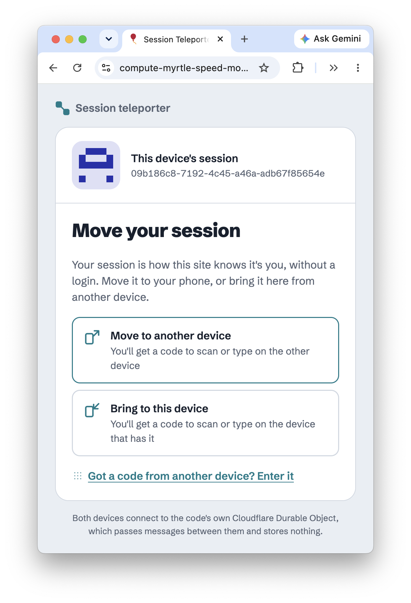
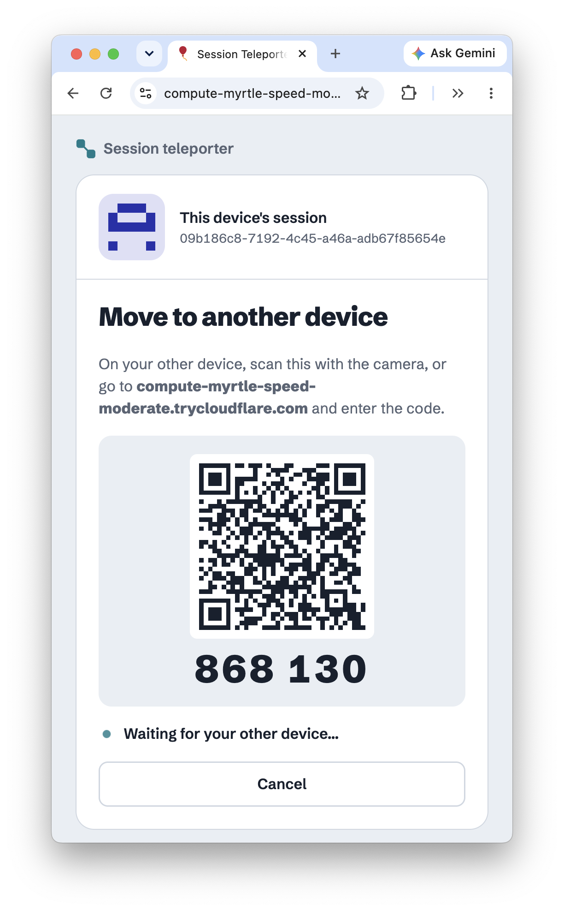
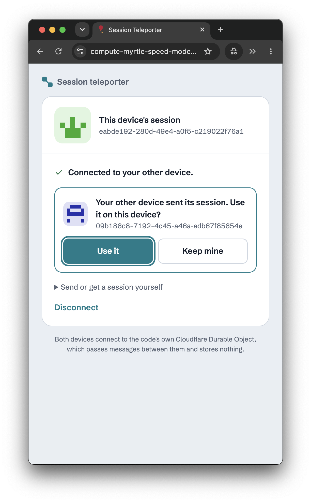
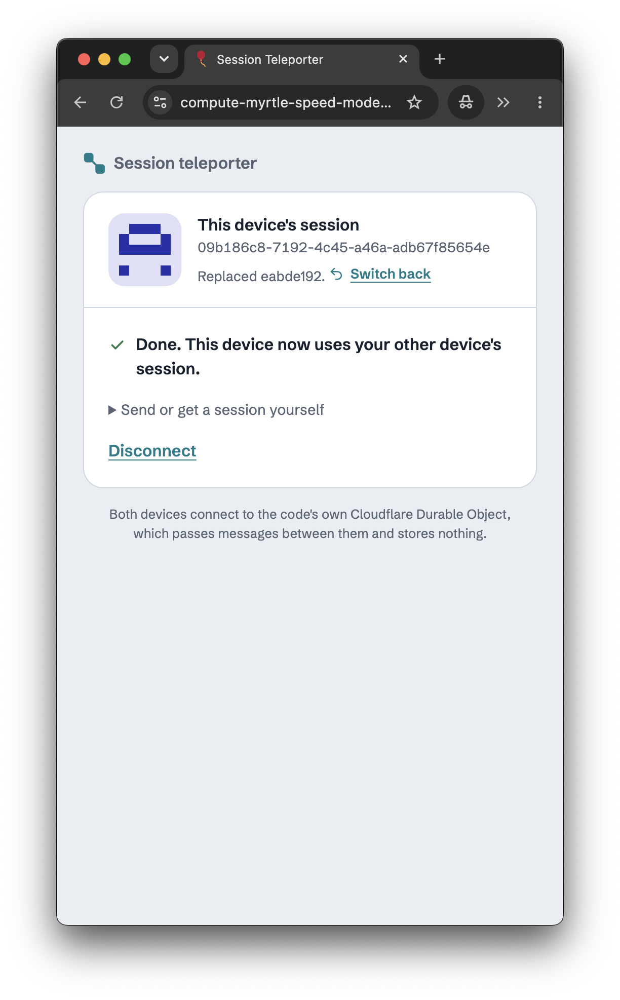

# session-teleporter: move a session between devices by PIN or QR code

A minimal example of **handing a session from one device to another** without logging in. You start by saying what you want: **move** this device's session to another device, or **bring** one to this device. This device then shows a 6-digit code and a QR code. When the other device scans or types it, the two are paired, and this device sends its session or asks for the other's by itself. The other device only has to agree: **Send it / Don't send** for a request, **Use it / Keep mine** for a session it's sent. Using one replaces the device's session, which survives a reload, and keeps the old one to switch back to. Each session has a **glyph**, a small pattern made from its ID, so you can see at a glance that both devices now have the same one. The goal is to move something like a Polis `xid` to a phone without a login.

It's a port of [patcon/partykit-teleport-session](https://github.com/patcon/partykit-teleport-session) from PartyKit to a Hono Worker and a Durable Object. The client still uses [PartySocket](https://www.npmjs.com/package/partysocket), which is just a reconnecting WebSocket, so it barely changed.

| sender: select option | sender: scan QR |
|---|---|
|  |  |

| receiver: confirm move | receiver: review details |
|---|---|
|  |  |

## Run it

```sh
pnpm install
pnpm dev        # http://localhost:8792
```

Open <http://localhost:8792> and click **Move to another device**. In another tab, click **Got a code from another device? Enter it** and type the code, or open `http://localhost:8792/?pin=<code>`, which is where the QR code points. Click **Use it** in the second tab: its session and glyph are now the first tab's, and **Switch back** undoes it. **Bring to this device** works the other way round. Each tab keeps its session in `sessionStorage`, so each tab acts as its own device and keeps its session across a reload. A real app would use `localStorage` or a cookie.

To try it with a real phone, scanning the QR code, the page needs a public address:

```sh
pnpm dev:share
```

After a few seconds it prints a link like `https://some-random-words.trycloudflare.com`, and a QR code of it in the terminal. Open that link on your laptop, click **Move to another device**, and scan the page's QR code with your phone. The link is a free Cloudflare [Quick Tunnel](https://developers.cloudflare.com/workers/local-development/local-dev-tunnels/) to your laptop, so everything still runs locally. Without it, press `t` then Enter in a running `pnpm dev` to open one.

`pnpm dev` runs `pnpm build` first (the `build` in `wrangler.jsonc`), which bundles `client/` into `public/dist/client.js` with esbuild, and it rebuilds when `client/` changes.

## How it works

- **One Durable Object per PIN.** Both devices open a socket to `/teleporter/<pin>`. The Worker sends the upgrade to `TELEPORTER.getByName(pin)`, so both land in the same `Teleporter` instance.
- **A relay.** `Teleporter` accepts each socket with the hibernation API (`ctx.acceptWebSocket`) and passes every message to the *other* socket on the same PIN (`ctx.getWebSockets()`). The only messages it sends itself are `peer_joined`, to both sockets when the second one connects, and `peer_left`, when one disconnects. It stores nothing, and it can sleep between messages while the sockets stay open.
- **Two devices per PIN.** A transfer is between two devices, so `Teleporter` turns away a third socket. It accepts it and closes it straight away with code `4000`, because a refused upgrade only reaches the browser as a generic error. The client tells PartySocket not to reconnect on that code (`shouldReconnectOnClose`) and says the code is already connecting two devices. When a device disconnects, its place is free again.
- **The protocol lives in the client.** Once paired, the device that showed the code sends its first message by itself: an offer if you chose to send, a request if you chose to get. After that both devices are equal, and either can send or ask from **Send or get a session yourself**.

  | Message | Sent when |
  |---|---|
  | `{ "type": "session_request" }` | You chose **Bring to this device**, or clicked **Get the other device's session**. The other device shows **Send it / Don't send** |
  | `{ "type": "session_request_denied" }` | The other device clicked **Don't send** |
  | `{ "type": "session_offer", "sessionId": "…" }` | You chose **Move to another device**, clicked **Send this device's session**, or agreed to a request. The other device shows **Use it / Keep mine** |
  | `{ "type": "session_used" }` | The other device clicked **Use it** |

  Nothing happens to a session without a click on the device it belongs to. A session ID that arrives is checked (letters, digits, `-` and `_`, up to 100 characters) and shown as text, never as HTML.

| PartyKit | Here |
|---|---|
| `partykit.json` `main`, `TransferParty` class | `src/index.ts` (Hono) + `src/teleporter.ts` (`Teleporter` Durable Object) |
| a room per id, `/parties/main/<room>` | a Durable Object per PIN via `getByName(pin)`, `/teleporter/<pin>` |
| `room.broadcast(data, [connection.id])` | a loop over `ctx.getWebSockets()` that skips the sender |
| `new PartySocket({ host, room, party })` | `new PartySocket({ host: location.host, basePath: "teleporter/<pin>" })` |
| `serve.build` + cache-busting script | wrangler's `build` runs esbuild. Static assets are served with ETags, so no cache busting |

| Route | Does |
|---|---|
| `GET /` | The page (static assets from `public/`) |
| `GET /teleporter/:pin` | WebSocket for a 6-digit PIN. A third socket on a PIN is closed with code `4000`. Returns 426 without an upgrade, and 404 for anything that isn't 6 digits |

## Caveats

It's a proof of concept, as the original was. Anyone who knows or guesses a PIN while it's open, and gets there before the real second device, can pair with you. They still can't take or replace your session without your click, but the prompts don't say which device is asking, and the session ID crosses the relay in plain text.
