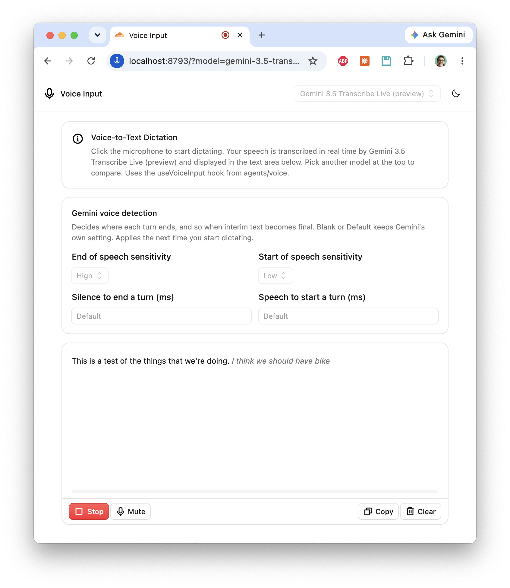
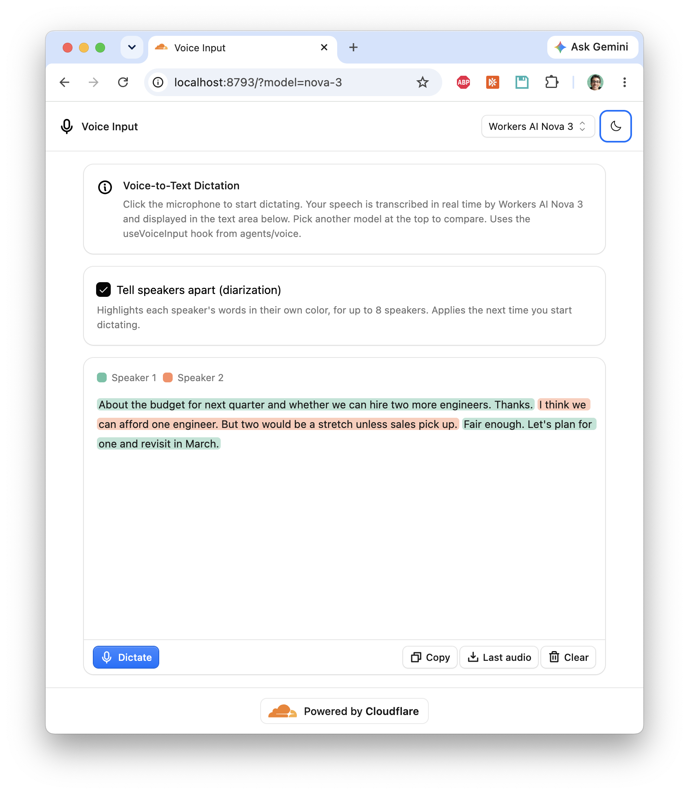

# streaming-voice-input: streaming speech-to-text

Voice-to-text dictation example using the `useVoiceInput` hook from `agents/voice`.

| gemini-3.5-transcribe-live (streaming) | @cf/deepgram/nova-3 (streaming) with diarization |
|---|---|
|  |  |

Captures microphone audio, streams it to an Agent Durable Object for real-time speech-to-text, and displays the transcript in a text area. `gemini-3.5-transcribe-preview` is the exception: it transcribes the whole recording once you stop. Pick one of these speech-to-text models to compare them:

| Model | Provider | Region |
|---|---|---|
| `nova-3` | Workers AI (Deepgram Nova 3) | Cloudflare |
| `flux` | Workers AI (Deepgram Flux) | Cloudflare |
| `gemini-3.5-transcribe-live-preview` | Vertex AI, Gemini Live API | `global` only |
| `gemini-3.5-transcribe-preview` | Vertex AI, `generateContent`, once you stop | `global` only |

The other Gemini Live models only answer with audio, so they're left out for now. That includes the only one served from the EU. See [Gemini Live models in the EU](#gemini-live-models-in-the-eu).

It's a port of [cloudflare/agents `examples/voice-input`](https://github.com/cloudflare/agents/tree/11f87b5332f6cf4dfff71d8249621b28f539280f/examples/voice-input), made standalone: it installs `agents` from npm instead of the monorepo's workspace.

## Run it

```bash
pnpm install
pnpm dev
```

Then open <http://localhost:8793>. `pnpm dev:share` also prints a public link, to try it from a phone.

Nova 3 and Flux need no API keys. It uses Workers AI, bound in `wrangler.jsonc`. The binding is remote, so you need to be logged in with `pnpm wrangler login`.

For Gemini, you need a Google Cloud project with Vertex AI enabled and `gcloud` logged in to it:

```bash
cp .dev.vars.example .dev.vars   # set GOOGLE_CLOUD_PROJECT
pnpm google-token                # puts `gcloud auth print-access-token` in .dev.vars
```

The token lasts about an hour, so run `pnpm google-token` again when it expires. When Gemini fails to start, the page only says "Speech recognition failed to start". The reason Vertex gave, such as an expired token, is in the terminal.

Pick the model from the menu at the top of the page. It's kept in the URL, such as `?model=nova-3`, so a link opens the same one. With no model in the URL, it uses Nova 3. The terminal logs each final transcript with the model's name, such as `[nova-3] Transcribed: "…"`.

### Tuning Gemini's voice detection

Gemini decides where each turn ends, and so when interim text becomes final, with its own voice activity detection. Steady background noise, such as an air conditioner, can hide the pauses, so a turn never ends. With a Gemini model picked, the page shows these settings, which go into the setup message's [`realtimeInputConfig.automaticActivityDetection`](https://cloud.google.com/vertex-ai/generative-ai/docs/live-api):

| Setting | Field | Try |
|---|---|---|
| End of speech sensitivity | `endOfSpeechSensitivity` | High, to end turns more readily |
| Start of speech sensitivity | `startOfSpeechSensitivity` | Low, so noise is less likely to count as speech |
| Silence to end a turn | `silenceDurationMs` | 500–800 |
| Speech to start a turn | `prefixPaddingMs` | |

Blank or Default keeps Gemini's own setting. They're saved in the model's agent instance, so they survive a reload, and apply the next time you start dictating. The terminal logs the ones each session starts with.

### Telling speakers apart with Nova 3

With Nova 3 picked, **Tell speakers apart (diarization)** turns on Nova 3's [`diarize`](https://developers.cloudflare.com/workers-ai/models/nova-3/) option, which numbers each word's speaker. The page highlights each speaker's words in their own color, from ColorBrewer's 8-color Set2 palette, and **Copy** puts each speaker's turn in its own paragraph, labeled "Speaker N:".

The built-in `WorkersAINova3STT` doesn't pass `diarize`, and `useVoiceInput` only passes on text. So `src/nova3-diarized.ts` is a copy of the built-in transcriber that asks for diarization, and marks each speaker change in the text with "[Speaker N]". The page splits the text on those markers (`src/speakers.ts`).

### Transcribing after you stop, with Gemini 3.5 Transcribe

`gemini-3.5-transcribe-preview` doesn't stream. While you dictate, the page only records. Once you press **Stop**, the page asks the agent for the transcript, and the agent sends the whole recording to Vertex's `generateContent` in a single request.

Gemini Live can't tell speakers apart. So with Gemini 3.5 Transcribe Live picked, **Tell speakers apart (diarization)** sends the recording to `gemini-3.5-transcribe-preview` once you stop. Its diarized transcript then replaces that session's live text. With the batch model picked, the same checkbox asks it to diarize. Either way, each speaker's words are colored as they are for Nova 3.

Diarization is `generationConfig.audioTranscriptionConfig: { mode: "VERBATIM", diarization: true }`, from Vertex's [`AudioTranscriptionConfig`](https://aiplatform.googleapis.com/$discovery/rest?version=v1beta1). Each speaker's stretch comes back as its own part, labeled `spk:0`, `spk:1`, and so on.

These were checked from the `patcon-local-cli` project on 29 September 2026:

- **Where it's served.** Vertex only serves the model from `global`. europe-west1, europe-west4 and us-central1 said it wasn't found.
- **Gemini API docs.** The Gemini API's [transcription docs](https://ai.google.dev/gemini-api/docs/transcribe) configure it through the Interactions API, with `transcription_config.mode.diarization_mode`. Vertex's Interactions API answered "Unsupported model interaction" for this model, so this example uses `generateContent`.
- **Long recordings.** A 10-minute recording, the most **Last audio** keeps, is 19MB of WAV, or 25MB once base64-encoded. It went through inline and came back diarized in about 71 seconds. The page waits up to 2 minutes.

### Downloading the last audio

**Last audio** downloads the last session's audio as a 16kHz mono WAV: exactly what the model heard, after the browser's noise suppression, echo cancellation and auto gain control. Each model keeps its own last recording, of up to 10 minutes, in its Durable Object's SQLite. Use it to replay a noisy recording against different settings.

## Gemini Live models in the EU

These are the Live models Vertex listed on 28 September 2026, and where each one answered. They were probed from the `patcon-local-cli` project, over the same `BidiGenerateContent` WebSocket this example uses, with an OAuth token from `gcloud auth print-access-token`. Each model was tried in europe-west1, europe-west4 and us-central1, and some also in `global`. A test clip of 16kHz speech checked that the transcript came back.

| Model | Stage | Answers with | Sessions opened in | Transcript tested in | EU? |
|---|---|---|---|---|---|
| `gemini-3.5-transcribe-live-preview` | Preview | Text | `global` | `global` | ❌ Not found in europe-west1, europe-west4 or us-central1 |
| `gemini-live-2.5-flash-native-audio` | GA | Audio | europe-west1, europe-west4, us-central1 | europe-west1 | ✅ |
| `gemini-3.8-live` | GA | Audio | us-central1 | us-central1 | ❌ Not found in europe-west1, europe-west4 or `global` |
| `gemini-3.5-live-translate-preview` | Preview | Not tested | Not tested | Not tested | Unknown |

- **Answers with:** the `responseModalities` the model accepts. None of these is a text-to-speech model. The audio ones are speech-to-speech: they reply to what they hear in a spoken voice. They also return `inputTranscription`, the text of what they heard, which is all this example would use. `gemini-3.8-live` closed the session with "Unsupported modality" when asked for text.
- **Not found:** Vertex accepted the WebSocket, then closed it with code 1008, saying the publisher model was not found in that location.
- **Transcript tested in:** every model tested returned the clip's words exactly. `gemini-live-2.5-flash-native-audio` only sent its transcript after about 2 seconds of silence followed the speech. A live stream has to keep sending audio through the pause, or end the turn itself.
- **Translate model:** `gemini-3.5-live-translate-preview` appeared in the model list, but wasn't probed.

So `gemini-live-2.5-flash-native-audio` is the only Live model served from the EU. Using it here would mean asking for audio replies and discarding them, keeping only the input transcription.

## How it works

### Server (`src/server.ts`)

Uses `withVoiceInput` — a lightweight mixin that only does STT. No TTS provider, no `onTurn` handler needed:

```typescript
import { Agent } from "agents";
import { withVoiceInput, WorkersAINova3STT } from "agents/voice";

const InputAgent = withVoiceInput(Agent);

export class VoiceInputAgent extends InputAgent<Env> {
  transcriber = new WorkersAINova3STT(this.env.AI);

  onTranscript(text, connection) {
    console.log("User said:", text);
  }
}
```

Each model is its own agent instance, named after the model: the page's menu passes the model as `useVoiceInput({ name })`. `createTranscriber()` reads `this.name` and returns that model's transcriber: `WorkersAINova3STT`, or the diarizing `WorkersAINova3DiarizedSTT` when that's turned on, `WorkersAIFluxSTT`, or `GeminiLiveSTT`. For `gemini-3.5-transcribe-preview`, it returns a transcriber that ignores the audio, so the audio is only recorded. The SDK calls it when you start dictating, so only one model is connected at a time, and only while you're recording.

`GeminiLiveSTT` implements the SDK's `Transcriber` interface. It's a package of its own, in [`packages/voice-gemini`](packages/voice-gemini), laid out like the providers in [cloudflare/agents `voice-providers/`](https://github.com/cloudflare/agents/tree/main/voice-providers) so it can move there later. Its tests run with `pnpm test`. Each session opens a WebSocket to Vertex's `BidiGenerateContent` with a text-only response, and streams the 16kHz PCM up as base64. Vertex sends back three things:
- `interimInputTranscription`: everything heard so far this turn, shown as interim text.
- `inputTranscription`: the whole turn, once, when Gemini's voice activity detection decides you've stopped. This becomes the final transcript.
- `voiceActivity`: `ACTIVITY_START` when you start speaking.

`GeminiBatchSTT`, in the same package, transcribes a finished recording with `generateContent`. It isn't a `Transcriber`, because the SDK drops anything a transcriber sends after you stop. The agent calls it from `transcribeLastAudio()`, a `@callable()` method that transcribes the last recording and marks each speaker change with "[Speaker N]". The page calls it when you stop, over the connection it already has open for settings. `@callable()` needs the `agents/vite` plugin in `vite.config.ts`.

### Client (`src/client.tsx`)

Uses `useVoiceInput` — a lightweight React hook that accumulates transcripts into a single string:

```tsx
import { useVoiceInput } from "agents/voice/react";

const { transcript, interimTranscript, isListening, start, stop, clear } =
  useVoiceInput({ agent: "VoiceInputAgent" });
```

Returns:

- **`transcript`** — accumulated final text from all utterances
- **`interimTranscript`** — real-time partial transcript (updates as you speak)
- **`isListening`** — whether the mic is active
- **`audioLevel`** — current audio level for visual feedback
- **`start()` / `stop()`** — control listening
- **`toggleMute()`** — mute without stopping
- **`clear()`** — reset the transcript
